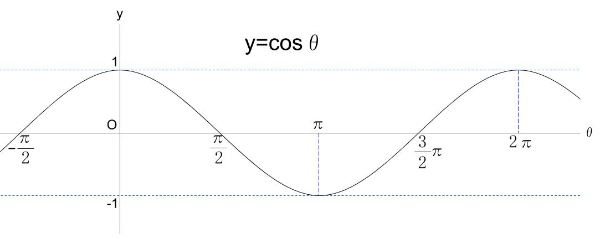

# ダメージ計算
## HPダメージ計算
基準ダメージ=BASE_DAMAGE=10  
標準攻防差=STANDARD_RANGE=500  
攻防差=(攻 - 防)　※絶対値がSTANDARD_RANGEを越える場合は丸める。  
-STANDARD_RANGE～STANDARD_RANGEの範囲。  
攻=ユニットの攻撃値 * 攻撃方法のダメージ倍率 * キャラクター本人のグレード値（Townの生活水準値、Townの発展によってどんどん上がっていく数値(1～99？)）  

・(攻 - 防) >= 0の場合  
HPダメージ = BASE_DAMAGE + BASE_DAMAGE * 0.5 * (1-cos(π * 攻防差/STANDARD_RANGE))  
・(攻 - 防) < 0の場合  
HPダメージ = BASE_DAMAGE - BASE_DAMAGE * 0.5 * (1-cos(π * 攻防差/STANDARD_RANGE))  

攻防差によってcosの-π~πのカーブを描く  
・差が小さいときの変化量は小さい  
・差が規定範囲の半分辺りで変化量は最大になるように徐々に増大  
・差が規定範囲に近くなると変化量が落ちる  
・規定範囲を超えた場合は規定範囲に丸める＝最大で倍ダメージ、最小で０ダメージ  
  

## LPダメージ計算
HPダメージ->LPダメージ変換レート(1.0)=LP_DAMAGE_RATIO  
HP減少割合=1 - (現HP / 最大HP)  
LPダメージ= HPダメージ * LP_DAMAGE_RATIO * HP減少割合  

残りHP量によってLPダメージが増減する  
・HPがmaxのときはLPダメージなし  
・HPが0のときはLPダメージ最大  

## HP回復計算
部隊熟練度ボーナス(0~1)=熟練度(１～10000)/熟練度スケール(10000)  
最前列と自分との奥行の距離=distance  
回復が最大になる距離(4.0)=FULL_RECOVERY_DISTANCE  
回復レート(0~1)=distance / FULL_RECOVERY_DISTANCE  

回復量 = (ユニットの標準回復量 * (1 + 部隊熟練度ボーナス)) * (1 + 回復レート)

## ノックバック発生判定
ボーナス(仮)=分隊の時間帯属性と一致する属性値が防御側よりも高いとノックバック判定有、低いとノックバック蓄積なし

ノックバック発生のための蓄積量(100)=KNOCKBACK_ACCUMULATE_LIMIT  
蓄積量=攻撃方法のノックバック蓄積量 * ボーナス  
蓄積量>KNOCKBACK_ACCUMULATE_LIMITでノックバック発生

## ノックバック量
ノックバック時間(0.7s)=KNOCKBACK_TIME  
攻撃方法のノックバック量倍率=AttackKnockBack  
防御側の標準ノックバック距離=Stagger  
ノックバック減速度=(2 * Stagger * AttackKnockBack) / (KNOCKBACK_TIME * KNOCKBACK_TIME)  
ノックバック初速=ノックバック減速度 * KNOCKBACK_TIME  

・ノックバック時間は全ユニットで共通で増減なし  
・ノックバックする距離はユニットのパラメータと攻撃方法の倍率によって変化  
・ノックバック時間で所定の距離移動して停止できるように初速と加速度を計算する  

# そのほか
所属列とは違う列の味方ユニットと接触していた場合は密集ペナルティとしてHPが減少する  
減少幅(2ポイント/s)=HP_LOSS_PENALTY  
=>後列とぶつかるとノックバックが止まって意味が薄くなってしまうので列が密着したときは交代して距離を保たないと不利な状況を作る  

所属列のユニットが一定以上倒されたら徐々にLP減少して勝手に撤退する  
減少を始めるユニット数の割合(0.5)=DECAY_START_RANGE  
減少量(10/s)=DECAY_LP_DAMAGE  
リーダー補正(5)=LEADER_NUMBER_FOLD
(現在ユニット数 * DECAY_LP_DAMAGE) / 初期ユニット数 < DECAY_START_RANGEの分隊はDECAY_LP_DAMAGE減少  
=>列のユニットが減ったときは列を早めに消滅させて、「１ユニットしかいない列を前に出す」といった変なシチュエーションを減らしたい  

# メモ
HP/LPの２段階パラメータにしたのは列交代の動機にするためのものだったが属性が時間ごとに変化する要素の追加で交代の動機が２種類存在するのでわかりにくくなっている可能性がある。
HP/LPを１つにしてもいいかも。

