## 動作確認環境  
windows11  

## 動いているところを確認する方法  
https://drive.google.com/file/d/1Ol2kOKf9dJzViVQCDb2BMcbfXXc5P4UH/view?usp=drive_link

上記のリンクからzipをダウンロード 
解凍後中のUnityProject.exeを実行する 
（ダウンロードの際に出るエラーは無視、exe実行時の警告も無視） 

## タイトル
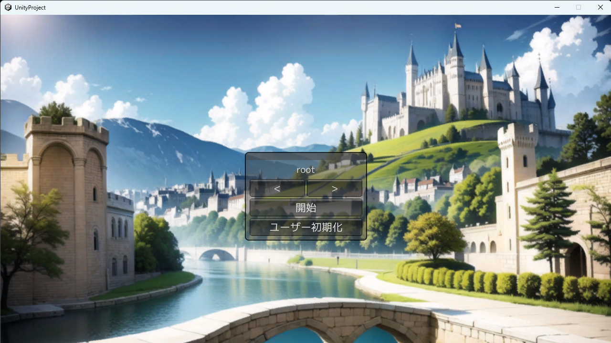 

## タウンパート
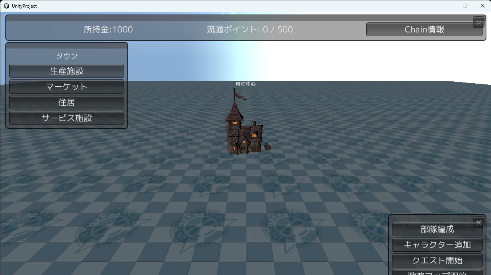 
タウンでは生産施設を建設して住人の需要に応えることでお金を稼ぐことが出来る。 
お金を使ってさまざまなものを購入することができるようになる。 

タウンパートの流れ
1.住居を建ててキャラクターを住まわせる 
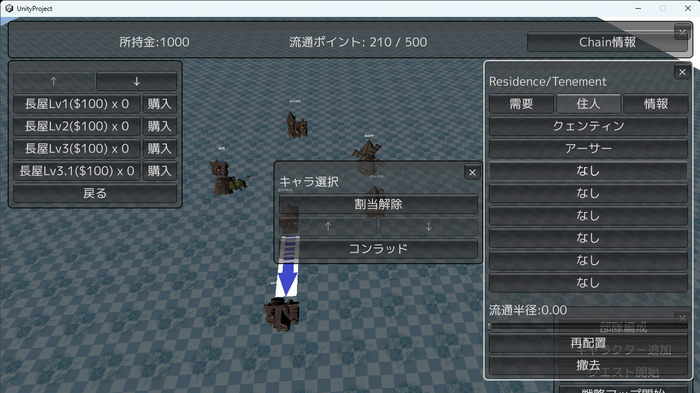 

2.生産施設を建てて労働者を割り当てる 
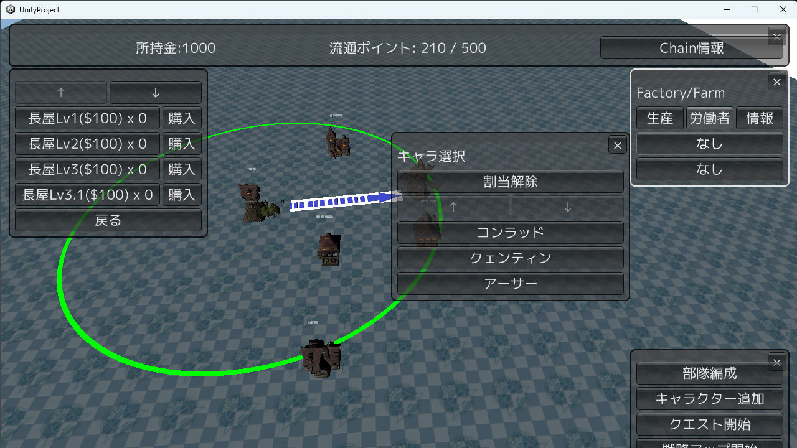 

3.サプライチェーンを構築する 
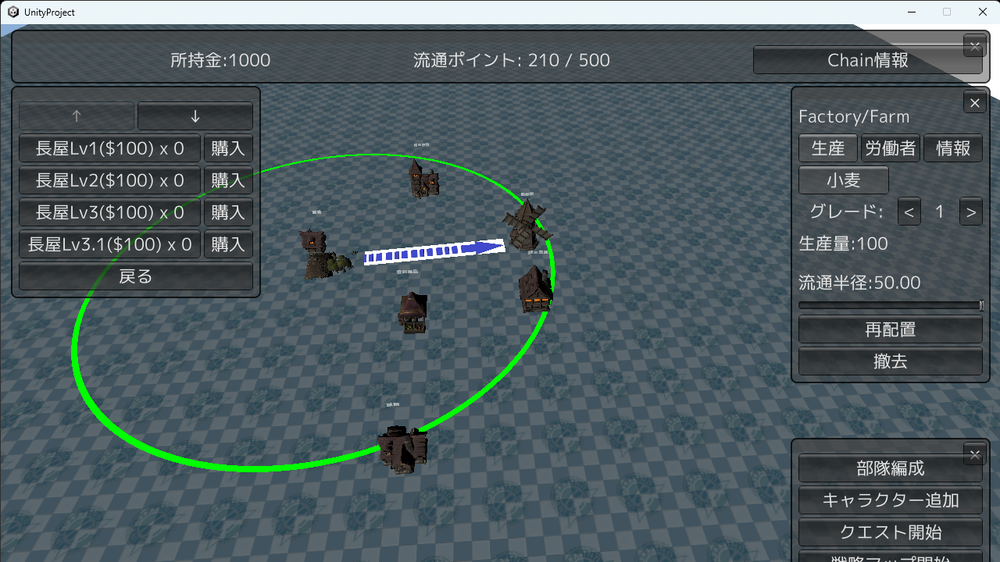 
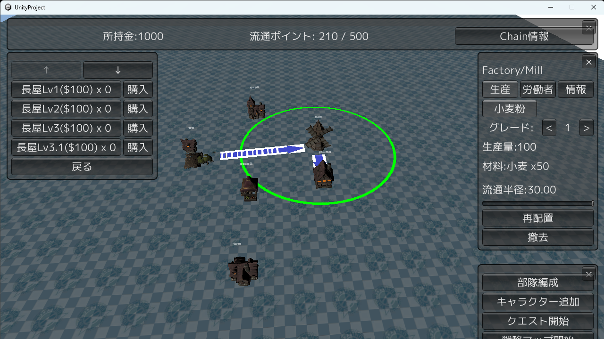 
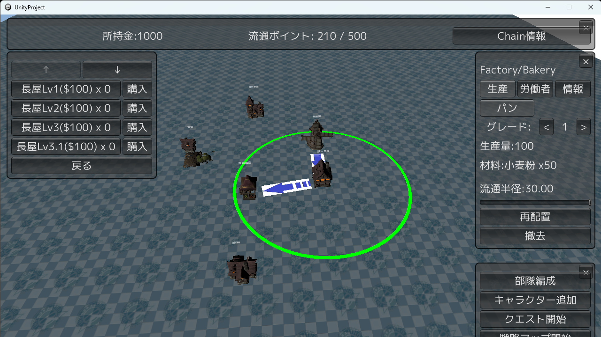 

生産施設は流通半径内にある建物に生産物を提供することができる 
生産物の中には原料を必要とするものがあるので原料を生産する施設の近くに生産施設を建てる 

4.マーケットを介して住人に生産物を提供する 
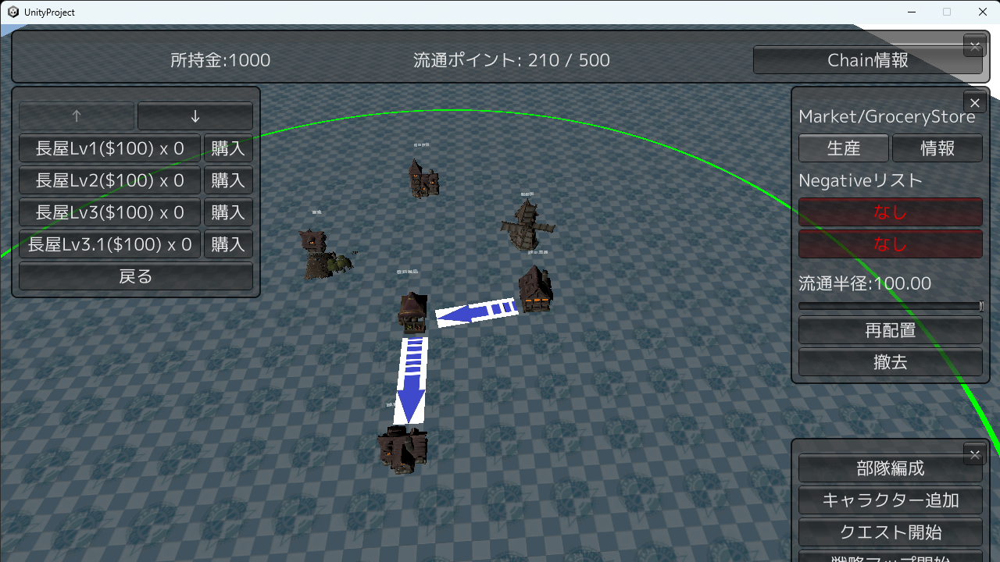 
住人に生産物を提供するにはマーケットが必要。 
生産施設と住居の間にマーケットを設置することで生産物を届けることができる。 
住人は需要に応じて生産物を消費し、お金を生み出す。 

## バトルパート
タウンからクエストを開始するとバトルが開始される 
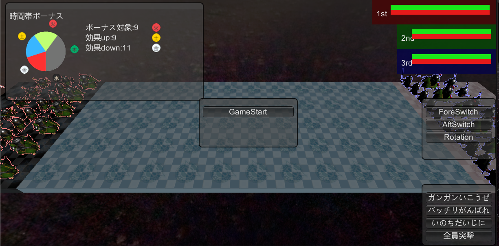 
バトルは開始すると自動で進行する。 
一番後ろにいるリーダーを倒すことで勝利できる。 
・ForeSiwthで前・中列の入れ替えができる 
・AftSwitchで中・後列の入れ替えができる 
・Rotationで前・中・後列の入れ替えができる 

## 部隊編成
タウンからorganize部隊編成を開始すると編成画面になる 
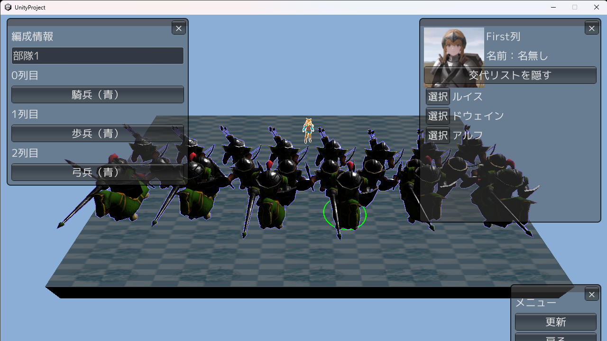 
バトルパートで使用する部隊のユニット編成を変更できる。 
ユニットを選択してタウンパートの住人を割り当てることができる。 
住人が割り当てられているユニットはアビリティなどで強化される。 

## 戦略パート
タウンから戦略マップを開始すると戦略パートが開始される 
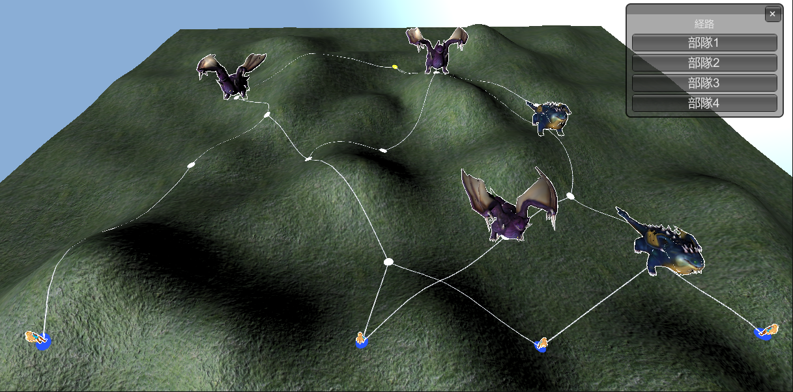 
1.部隊を選択して3Dマップの青い丸をクリックすることで部隊を配置できる 
2.配置したユニットを選び移動先を選択すると移動する 
3.移動先に敵がいた場合はバトルが始まる 

## キャラクター追加
タウンからキャラクター追加を選ぶと開始される
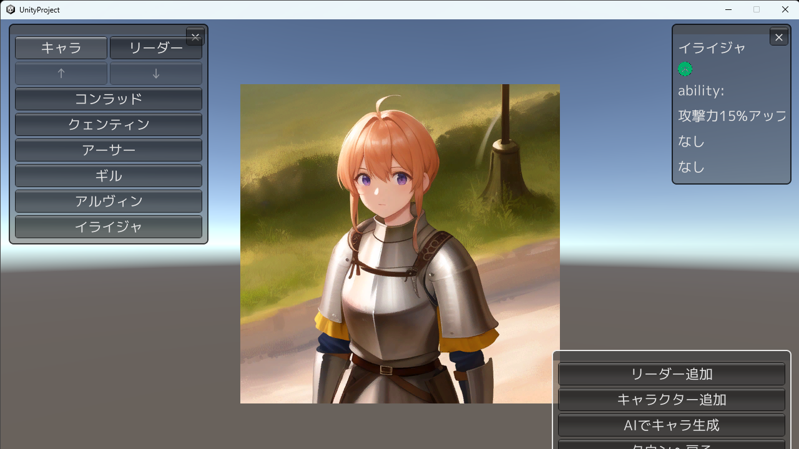 
Stable Diffusion web UIをローカルPCに導入し、APIが動かせる場合はAIでキャラ生成ができる
https://github.com/AUTOMATIC1111/stable-diffusion-webui